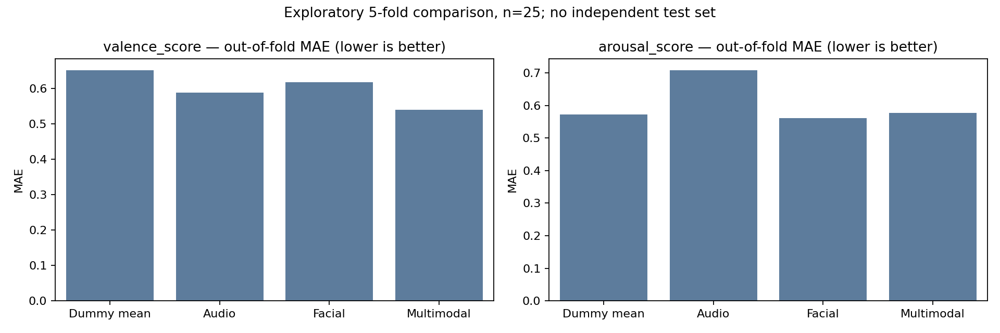

# Exploratory model comparison

Same five folds for every modality; training-fold preprocessing only. Lower errors are better.

| Target | Model | MAE | RMSE |
|---|---|---:|---:|
| valence_score | Dummy mean | 0.6520 | 0.7616 |
| valence_score | Audio | 0.5885 | 0.7444 |
| valence_score | Facial | 0.6176 | 0.7512 |
| valence_score | Multimodal | 0.5391 | 0.6875 |
| arousal_score | Dummy mean | 0.5720 | 0.7382 |
| arousal_score | Audio | 0.7089 | 0.8976 |
| arousal_score | Facial | 0.5607 | 0.7749 |
| arousal_score | Multimodal | 0.5767 | 0.8241 |

These are exploratory out-of-fold regression results on 25 records, not independent test-set validation. Combined features do not consistently improve on the dummy or unimodal models. Numeric treatment of ordinal targets is an approximation. Do not infer deployment readiness or reliable emotion classification from these scores.

