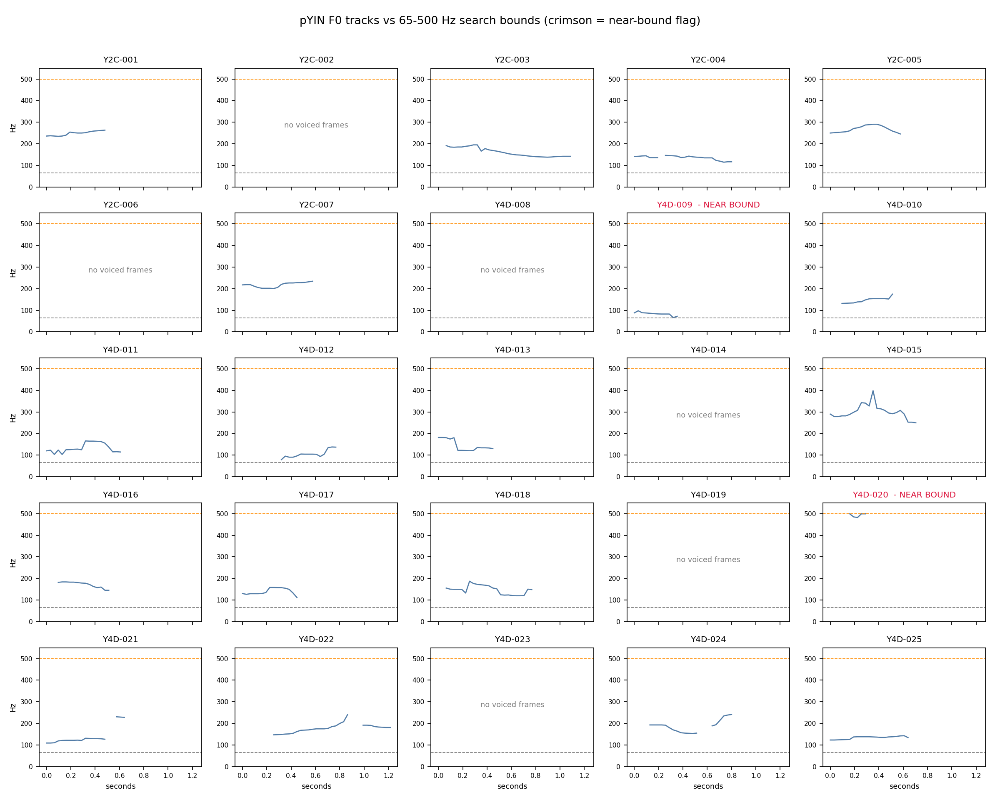
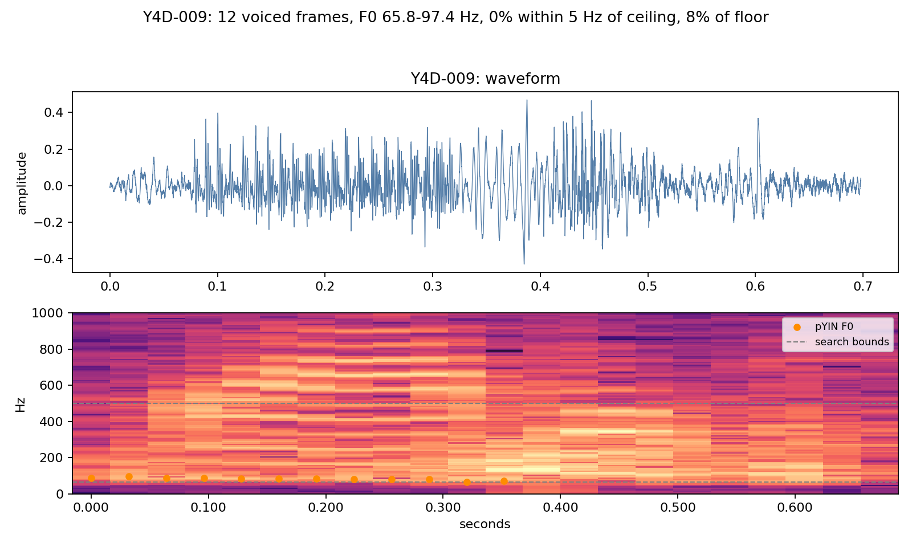
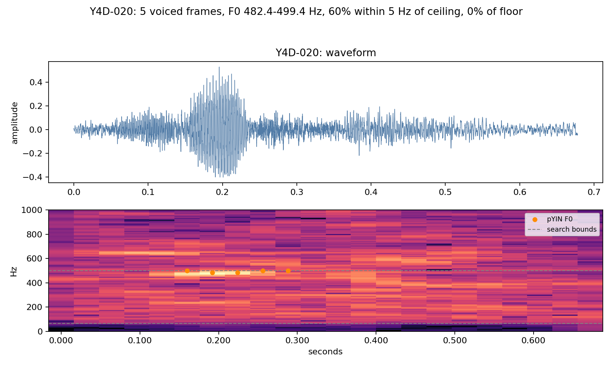
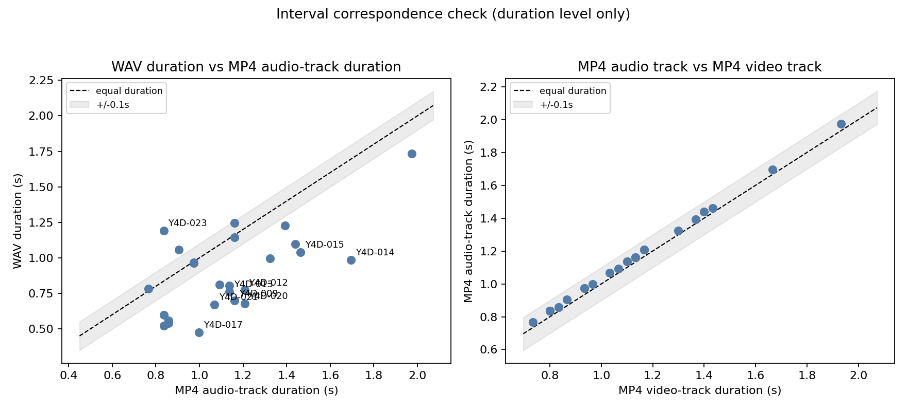

# Measurement checks

Generated by `scripts/measurement_checks.py` on 2026-10-02. Automates the reviewable parts of the remaining measurement checks in `docs/VALIDATION.md`; manual listening and video inspection are still required where noted.

## 1. Pitch tracks vs search bounds (65-500 Hz)

- pYIN recomputed on all 25 WAVs with the pipeline settings (16 kHz, frame 2048, hop 512, trim 30 dB): pitch detected in 19/25 recordings; recomputed F0 maxima match `features_raw.csv` in 25/25 recordings.
- Near-bound rule: any voiced frame within 5 Hz of a bound. Flagged: Y4D-009, Y4D-020.

| Recording | Voiced frames | F0 min (Hz) | F0 max (Hz) | % frames near ceiling | % frames near floor |
|---|---:|---:|---:|---:|---:|
| Y4D-009 | 12 | 65.8 | 97.4 | 0% | 8% |
| Y4D-020 | 5 | 482.4 | 499.4 | 60% | 0% |

- `Y4D-020` sits at the configured ceiling: its voiced estimates cluster just below 500 Hz, which can indicate an octave/harmonic error rather than true F0. Inspect the detail figure while listening to the recording before using its pitch features; do not automatically accept or discard them.
- Recordings with no voiced frames are unvoiced/failed pitch, not silence (see `pitch_track_check.csv`).

CSV: `Audio_Feature/output/pitch_track_check.csv`

## 2. WAV vs MP4 interval correspondence

- Pairs checked: 25; filename stems match in 25/25.
- WAV vs MP4 audio track: differences range -0.709 to +0.354 s; 20/25 exceed 0.1 s.
- MP4 audio vs MP4 video track: differences range +0.024 to +0.042 s; 0/25 exceed 0.1 s.
- WAV vs MP4 video track: 21/25 exceed 0.1 s, matching the 21 `duration_review_flag` values in `sample_quality.csv`.
- Interpretation: the existing duration review flags are driven by WAV-to-MP4 duration differences, not by misalignment between the MP4's own audio and video tracks, which correspond within one video frame. Interval correspondence between the standalone WAVs and the MP4s is NOT established at the sub-second level.
- This is duration-level evidence only. Content-level correspondence (cross-correlating the WAV against decoded MP4 audio) was not possible here: no AAC decoder or ffmpeg is available in this environment.
- Consequence: keep the existing rule - do not claim sample-level or frame-level synchronization between modalities; participant-level pairing only.

CSV: `Multimodal_Feature/output_multimodal/interval_check.csv`

## 3. Head-pose sign conventions

- `head_pose_deg` was fed known rotation matrices (Rz@Ry@Rx with single-axis and combined angles). Max absolute error across 13 cases: 3.55e-15 deg. Sign conventions: positive pitch = +x rotation, positive yaw = +y rotation, positive roll = +z rotation.
- Scale normalization check (matrix x3.7): max deviation 7.11e-15 deg.
- Observed per-participant means (from `face_features_raw.csv`):

| Axis | Min of means (deg) | Max of means (deg) | Max within-clip std (deg) | All abs(mean) < 90 |
|---|---:|---:|---:|---|
| pitch | -12.4 | 9.9 | 8.1 | True |
| yaw | -9.7 | 15.9 | 10.2 | True |
| roll | -8.9 | 14.5 | 6.1 | True |

- These checks validate the extraction math against standard rotation matrices and confirm plausible observed ranges. They do NOT validate signs against independently labeled head poses in the videos; that still requires visiting recordings with known head orientations.

CSV: `Facial_Feature/output_face/head_pose_sign_check.csv`, `Facial_Feature/output_face/head_pose_observed_ranges.csv`

## Still manual / pending

- Listen to the flagged recordings while viewing their F0 detail figures (`Y4D-020` above all).
- Visual inspection of landmark/expression tracking on the source videos: not run; it requires a MediaPipe install, which would downgrade numpy in the current environment. The README MediaPipe metrics notice applies whenever it is run.
- Content-level WAV/MP4 correspondence needs an AAC decoder (e.g. ffmpeg); re-run this script's interval section after decoding if that claim is ever required.

